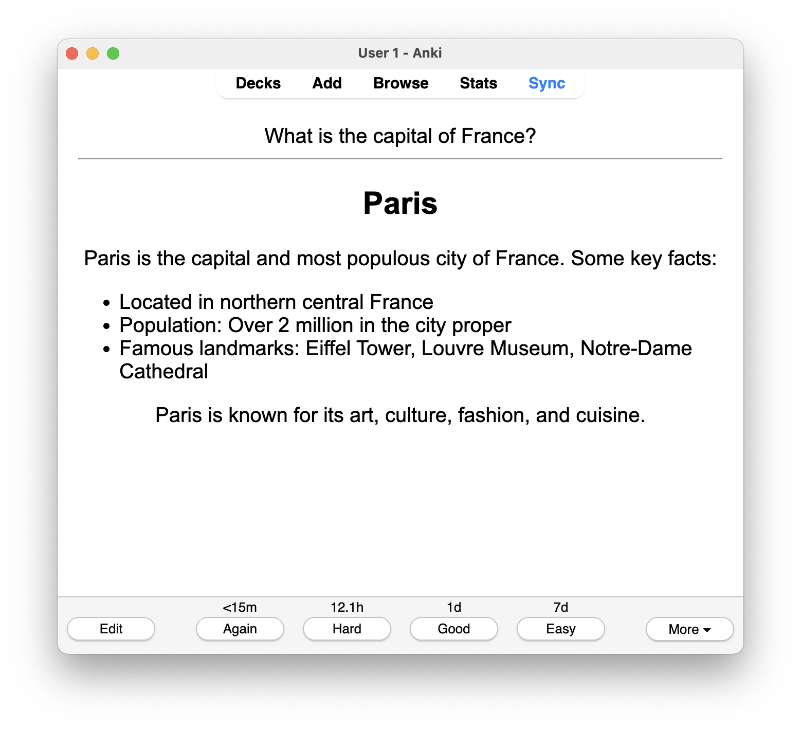

# Note2Anki

An Obsidian plugin to create Anki cards from Obsidian notes.

## Set up

1. Install this plugin through Obsidian's community plugins directory
1. Install [AnkiConnect](https://foosoft.net/projects/anki-connect/), a add-on for Anki that exposes an HTTP API. See the [installation instructions](https://foosoft.net/projects/anki-connect#installation).
1. While Anki is open, grant Obsidian access to the AnkiConnect API by going into Note2Anki's settings and clicking "Request Permission"
1. Now you're ready to create cards!

## Creating Anki cards

Note2Anki scans your vault's files for notes designated to be converted to Anki cards. By default, the Note2Anki will recursively search your entire vault for notes to be converted to cards, you can adjust these defaults in the plugin settings.

To set up a note to be converted, add a file property `anki-deck` with a value of the target deck name in Anki. The note's title will be the card's front, and the note's content will be the back of the card. Markdown is rendered as HTML when creating the cards, so formatting will be preserved.

Once you have added notes, click the Note2Anki button in the Obsidian ribbon.

### Example note

Filename: `What is the capital of France?.md`

```markdown
---
anki-deck: Test
---

## Paris

Paris is the capital and most populous city of France. Some key facts:

-   Located in northern central France
-   Population: Over 2 million in the city proper
-   Famous landmarks: Eiffel Tower, Louvre Museum, Notre-Dame Cathedral

Paris is known for its art, culture, fashion, and cuisine.
```

Output:



## Limitations

-   The deck set as `anki-deck` must exist prior to running Note2Anki
-   This plugin is only supported for desktop
